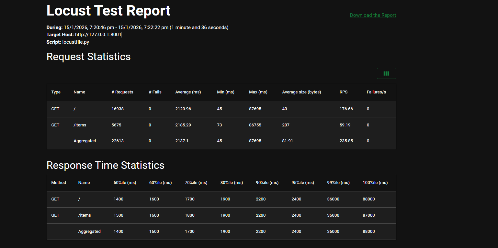
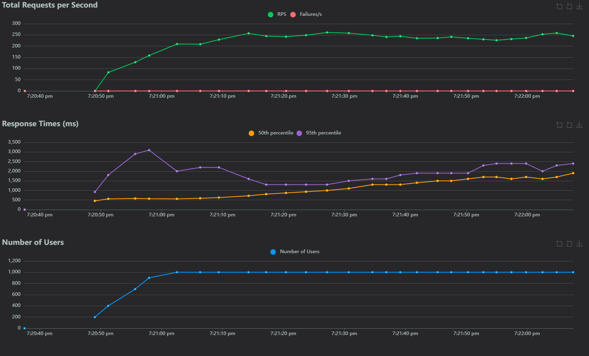

# MicroFW

A lightweight, high-performance asynchronous Python micro-framework for building modern microservices and web applications.

[](https://www.python.org/downloads/)
[](LICENSE)

## Features

- **🚀 Async-First Architecture** - Built on ASGI with native async/await support for maximum performance
- **🔌 Microservices Ready** - Built-in service registry and client with automatic trace propagation
- **🛡️ Robust Middleware System** - Extensible middleware architecture with abstract base class
- **💾 Database Integration** - Seamless SQLAlchemy async ORM support with transaction management
- **⚡ Concurrency Control** - Automatic request limiting to prevent service overload
- **📝 Data Validation** - Pydantic integration for automatic request/response validation
- **🎯 Dependency Injection** - Automatic parameter injection for requests, database sessions, and validated models
- **⚙️ Centralized Configuration** - Environment-based settings management
- **🔄 Lifecycle Events** - Startup and shutdown hooks for resource management

## Installation

```bash
pip install microfw
```

## Quick Start

```python
from microfw.app import App
from microfw.response import Response
from microfw.asgi import ASGI

app = App()

@app.route("/", methods=["GET"])
async def index(request):
    return Response({"message": "Hello, MicroFW!"})

asgi = ASGI(app)
```

Run with:
```bash
uvicorn main:asgi --reload
```

## Configuration

Configure MicroFW using environment variables:

| Variable | Default | Description |
|----------|---------|-------------|
| `MICROFW_SERVICE_NAME` | `microfw-app` | Service name for distributed tracing |
| `MICROFW_CONCURRENCY_LIMIT` | `100` | Maximum concurrent requests |
| `MICROFW_CONCURRENCY_MAX_WAIT` | `0.1` | Maximum wait time (seconds) for request slot |
| `MICROFW_DEBUG` | `False` | Enable debug mode |

## Core Concepts

### Routing

Define routes with path parameters and HTTP methods:

```python
@app.route("/users/{user_id}", methods=["GET"])
async def get_user(request, user_id):
    return Response({"user_id": user_id})
```

### Request Validation with Pydantic

Automatic request body validation and parsing:

```python
from pydantic import BaseModel

class UserCreate(BaseModel):
    name: str
    email: str

@app.route("/users", methods=["POST"])
async def create_user(user_data: UserCreate):
    return Response({"name": user_data.name, "email": user_data.email}, status_code=201)
```

### Database Integration

Built-in SQLAlchemy async support with automatic session management:

```python
from microfw.orm_db import Database
from microfw.middleware.db import DatabaseMiddleware
from microfw.middleware.transaction import TransactionMiddleware
from microfw.model import Base
from sqlalchemy import String
from sqlalchemy.orm import Mapped, mapped_column

# Initialize database
db = Database("sqlite+aiosqlite:///app.db")
app.middleware(DatabaseMiddleware(db))
app.middleware(TransactionMiddleware())

# Define models
class User(Base):
    __tablename__ = "users"
    id: Mapped[int] = mapped_column(primary_key=True)
    name: Mapped[str] = mapped_column(String(50))

# Lifecycle hooks
@app.on_event("startup")
async def startup():
    await db.connect()
    async with db.engine.begin() as conn:
        await conn.run_sync(Base.metadata.create_all)

@app.on_event("shutdown")
async def shutdown():
    await db.disconnect()

# Use in routes
@app.route("/users", methods=["GET"])
async def list_users(request):
    from sqlalchemy import select
    result = await request.db.execute(select(User))
    users = result.scalars().all()
    return Response([{"id": u.id, "name": u.name} for u in users])
```

### Microservices Communication

Service-to-service communication with automatic trace propagation:

```python
# Register services
app.add_service("inventory", "http://inventory-service:8001")
app.add_service("payment", "http://payment-service:8002")

# Call services
@app.route("/order", methods=["POST"])
async def create_order(request):
    # Trace IDs are automatically propagated
    inventory_response = await request.client.get("inventory", "/items/123")
    
    if inventory_response.status_code == 200:
        payment_response = await request.client.post(
            "payment", 
            "/charge",
            json={"amount": 100}
        )
        return Response(payment_response.json())
    
    return Response({"error": "Item not found"}, status_code=404)
```

### Middleware

Create custom middleware by extending the base class:

```python
from microfw.middleware import Middleware
from microfw.response import Response

class AuthMiddleware(Middleware):
    async def __call__(self, request, call_next):
        token = request.headers.get("Authorization")
        if not token:
            return Response({"error": "Unauthorized"}, status_code=401)
        
        # Validate token logic here
        response = await call_next(request)
        return response

# Apply globally
app.middleware(AuthMiddleware())

# Or per-route
@app.route("/protected", middlewares=[AuthMiddleware()])
async def protected_route(request):
    return Response({"message": "Access granted"})
```

### Concurrency Control

Protect your service from overload with built-in concurrency limiting:

```python
from microfw.middleware.concurrency import ConcurrencyMiddleware

# Global limit
app.middleware(ConcurrencyMiddleware(limit=100, max_wait=0.1))

# Per-route limit
@app.route("/heavy-task", middlewares=[ConcurrencyMiddleware(limit=5)])
async def heavy_task(request):
    # Only 5 concurrent requests allowed
    return Response({"status": "processing"})
```

### Transaction Management

Automatic database transaction handling:

```python
from microfw.middleware.transaction import TransactionMiddleware

# Automatic commit on success, rollback on error
@app.route("/users", methods=["POST"], middlewares=[TransactionMiddleware()])
async def create_user(request):
    data = await request.json()
    user = User(name=data["name"])
    request.db.add(user)
    # Transaction automatically committed
    return Response({"status": "created"}, status_code=201)
```

## Advanced Features

### Dependency Injection

MicroFW automatically injects dependencies based on parameter names and type hints:

- `request` - The request object
- `request.db` - Database session (when DatabaseMiddleware is enabled)
- `request.client` - Service client for microservices communication
- Pydantic models - Automatic request body validation

### Lifecycle Events

Hook into application lifecycle:

```python
@app.on_event("startup")
async def on_startup():
    print("Application starting...")
    # Initialize resources

@app.on_event("shutdown")
async def on_shutdown():
    print("Application shutting down...")
    # Cleanup resources
```

### Context Propagation

Automatic trace ID and span propagation for distributed tracing:

```python
# Access trace information
@app.route("/trace-info")
async def trace_info(request):
    return Response({
        "trace_id": request.context.trace_id,
        "span_id": request.context.span_id
    })
```

## Examples

### Complete CRUD Application

```python
from microfw.app import App
from microfw.response import Response
from microfw.asgi import ASGI
from microfw.orm_db import Database
from microfw.middleware.db import DatabaseMiddleware
from microfw.middleware.transaction import TransactionMiddleware
from microfw.model import Base
from sqlalchemy import String, select
from sqlalchemy.orm import Mapped, mapped_column
from pydantic import BaseModel

app = App()
db = Database("sqlite+aiosqlite:///app.db")

# Middleware
app.middleware(DatabaseMiddleware(db))
app.middleware(TransactionMiddleware())

# Model
class Item(Base):
    __tablename__ = "items"
    id: Mapped[int] = mapped_column(primary_key=True)
    name: Mapped[str] = mapped_column(String(50))

# Validation Schema
class ItemCreate(BaseModel):
    name: str

# Lifecycle
@app.on_event("startup")
async def startup():
    await db.connect()
    async with db.engine.begin() as conn:
        await conn.run_sync(Base.metadata.create_all)

@app.on_event("shutdown")
async def shutdown():
    await db.disconnect()

# Routes
@app.route("/items", methods=["GET"])
async def list_items(request):
    result = await request.db.execute(select(Item))
    items = result.scalars().all()
    return Response([{"id": i.id, "name": i.name} for i in items])

@app.route("/items", methods=["POST"])
async def create_item(request, item_data: ItemCreate):
    item = Item(name=item_data.name)
    request.db.add(item)
    await request.db.commit()
    await request.db.refresh(item)
    return Response({"id": item.id, "name": item.name}, status_code=201)

@app.route("/items/{id}", methods=["GET"])
async def get_item(request, id):
    result = await request.db.execute(select(Item).where(Item.id == int(id)))
    item = result.scalar_one_or_none()
    if item:
        return Response({"id": item.id, "name": item.name})
    return Response({"error": "Not found"}, status_code=404)

asgi = ASGI(app)
```

## Performance

MicroFW is designed for high-performance asynchronous request handling. Below are the results from Locust stress testing:

### Load Test Results



*Stress test statistics showing request throughput, response times, and failure rates*

### Requests Per Second



*Real-time requests per second (RPS) during load testing, demonstrating the framework's ability to handle high concurrent loads*

The framework successfully handles high concurrent loads with minimal latency, making it suitable for production microservices deployments.

## Requirements

- Python 3.7+
- uvicorn (ASGI server)
- sqlalchemy (Database ORM)
- aiosqlite (Async SQLite driver)
- pydantic (Data validation)
- httpx (HTTP client for service calls)

## License

MIT License - see LICENSE file for details.

## Contributing

Contributions are welcome! Please feel free to submit a Pull Request.

## Acknowledgments

This project was built with inspiration and knowledge from various excellent resources:

- **[Python Web Framework Tutorial Series](https://www.youtube.com/playlist?list=PLui3EUkuMTPgZcV0QhQrOcwMPcBCcd_Q1)** - Comprehensive tutorial series on building web frameworks
- **[FastAPI](https://fastapi.tiangolo.com/)** - Modern, fast web framework for building APIs
- **[Flask](https://flask.palletsprojects.com/)** - Lightweight WSGI web application framework
- **[Django](https://www.djangoproject.com/)** - High-level Python web framework
- **[Stack Overflow](https://stackoverflow.com/)** - Community-driven Q&A platform
- **[GeeksforGeeks](https://www.geeksforgeeks.org/)** - Programming tutorials and resources
- **[Google Antigravity AI](https://deepmind.google/technologies/gemini/)** - AI-assisted development

Special thanks to the open-source community for their continuous support and contributions.

## Support

If you find this project helpful, consider supporting its development:

[](https://www.buymeacoffee.com/yourusername)
